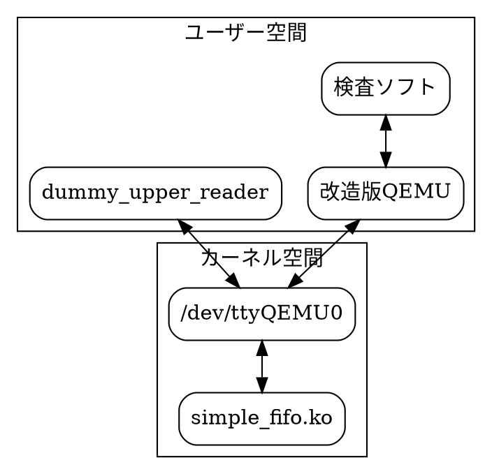

# SUMMARY

上リーダのQemu用ダミーです。

別途以下を必要とします。

- [仮想ttyデバイスドライバ](https://github.com/tyano463/cdev_ipc)
- [RA2L1のUARTをローカルに閉じたもの](https://github.com/tyano463/qemu.git)

Qemuはブランチを`renesas/ra2l1`にする必要があります。

# 処理の流れ

## UART

graphvizのコード

